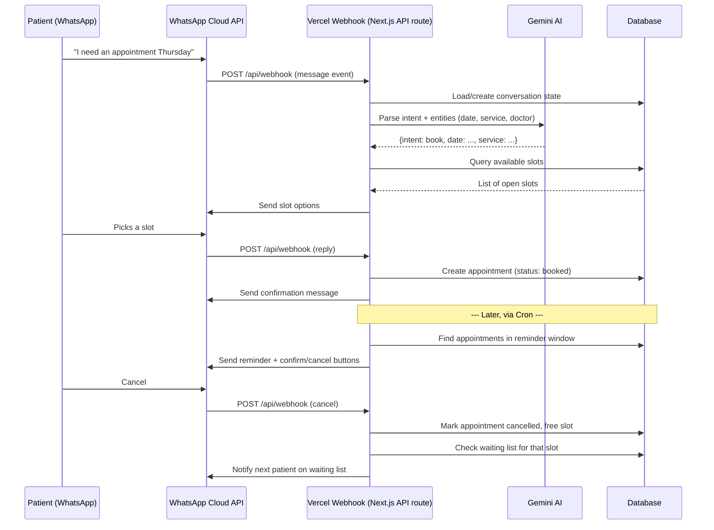

# WhatsApp Clinic Appointment Bot — Project Plan

## 1. Overview

An automated appointment system for a clinic, running entirely over WhatsApp.
Patients message the clinic's WhatsApp number, an AI layer (Gemini) understands
what they want, the system checks/books slots, and handles the full lifecycle:
confirmation → reminder → confirm/cancel → waiting list backfill.

**Stack**
| Layer | Choice |
|---|---|
| Chat channel | WhatsApp Business Cloud API (Meta, official) |
| Hosting | Vercel (serverless functions) |
| AI / NLU | Google Gemini API |
| Database | Postgres (Neon or Vercel Postgres) or Supabase |
| Scheduling / reminders | Vercel Cron Jobs |
| Source control | Git (GitHub) → auto-deploy to Vercel on push |

> **Note on WhatsApp provider:** Meta's Cloud API is free and official but requires
> business verification and a bit more webhook setup. Twilio wraps the same API
> with an easier onboarding but adds per-message cost. Both fit this architecture —
> swapping later only touches the `whatsapp/` integration layer, nothing else.

---

## 2. Architecture / Message Flow



---

## 3. Data Models

```
Patient
  id, phone_number (unique), name, created_at

Appointment
  id, patient_id, slot_id, status
    [pending | booked | confirmed | cancelled | completed | no_show]
  created_at, updated_at

Slot
  id, doctor_or_service, start_time, end_time, is_available (bool)

WaitingList
  id, patient_id, desired_date_range, service, status [waiting | offered | expired]
  created_at

ConversationState
  phone_number (key), current_step, context_json, updated_at
  -- needed because WhatsApp webhooks are stateless; this tracks
  -- "where the patient is" in the booking flow between messages
```

---

## 4. WhatsApp Integration Notes

- One webhook endpoint (`/api/webhook`) handles both:
  - `GET` — Meta's verification handshake (hub.challenge)
  - `POST` — incoming messages/status updates
- Send messages via `POST https://graph.facebook.com/v20.0/{phone-number-id}/messages`
- Use **WhatsApp message templates** for anything sent outside the 24-hour
  customer-service window (reminders, waiting-list offers) — Meta requires
  pre-approved templates for these, plain text won't send.
- Use **interactive buttons** ("Confirm" / "Cancel") for reminder replies —
  much more reliable to parse than free text.

## 5. Gemini AI Integration Notes

- Use Gemini for: intent classification (book/cancel/reschedule/FAQ), entity
  extraction (date, time, service/doctor), and natural free-text replies.
- Keep booking-critical logic (slot locking, double-booking prevention) in
  your own code, not the model — Gemini decides *what the patient wants*,
  your backend decides *what's actually allowed*.
- Feed Gemini the current conversation state + a short system prompt defining
  the clinic's services/doctors so it doesn't hallucinate options.

## 6. Reminder / Cron Strategy

- Vercel Cron Job (e.g. every 15–30 min) hits `/api/cron/reminders`
- That endpoint queries appointments where `start_time` is within the
  reminder window (e.g. 24h and/or 2h before) and `reminder_sent = false`
- Sends reminder template with Confirm/Cancel buttons, marks `reminder_sent = true`

## 7. Environment Variables (to be filled in later)

```
WHATSAPP_TOKEN=
WHATSAPP_PHONE_NUMBER_ID=
WHATSAPP_VERIFY_TOKEN=
GEMINI_API_KEY=
DATABASE_URL=
```

## 8. Repo Structure (proposed)

```
/api
  /webhook.ts          # WhatsApp inbound messages
  /cron
    /reminders.ts      # scheduled reminder sender
/lib
  /whatsapp.ts         # send message / template helpers
  /gemini.ts           # intent parsing helpers
  /db.ts               # db client + queries
/db
  /schema.sql
PROJECT_PLAN.md
pipeline.json
vercel.json            # cron config
```

---

## 9. Project Phases

See `pipeline.json` for the machine-readable version of this list (with status
tracking). Summary:

1. **Setup** — repo, Vercel project, WhatsApp Business account, Gemini key, DB
2. **WhatsApp Webhook** — receive & send messages, verification handshake
3. **AI Understanding Layer** — Gemini intent/entity extraction, prompt design
4. **Slot & Booking Logic** — DB schema, availability checks, booking transaction
5. **Confirmation System** — templates, send-on-book
6. **Reminder System** — Vercel Cron, reminder window logic
7. **Confirm/Cancel Handling** — button replies update appointment status
8. **Waiting List Backfill** — on cancel, notify next patient in queue
9. **Testing & QA** — conversation edge cases, double-booking, timezones
10. **Deploy & Monitor** — production launch, logging/alerts

---

## 10. Next Steps

1. Confirm WhatsApp provider (Meta Cloud API vs Twilio)
2. Pick DB provider (Neon / Supabase / Vercel Postgres)
3. You provide: WhatsApp token + phone number ID, Gemini API key
4. I scaffold Phase 1 (webhook skeleton) once repo/DB are ready
